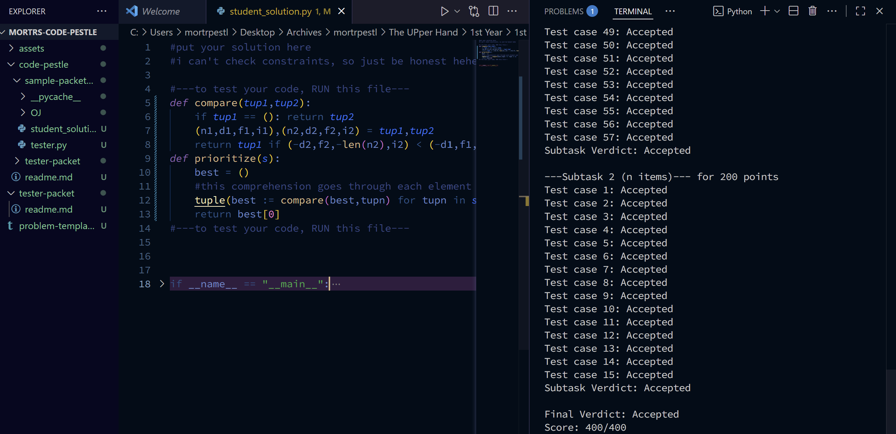
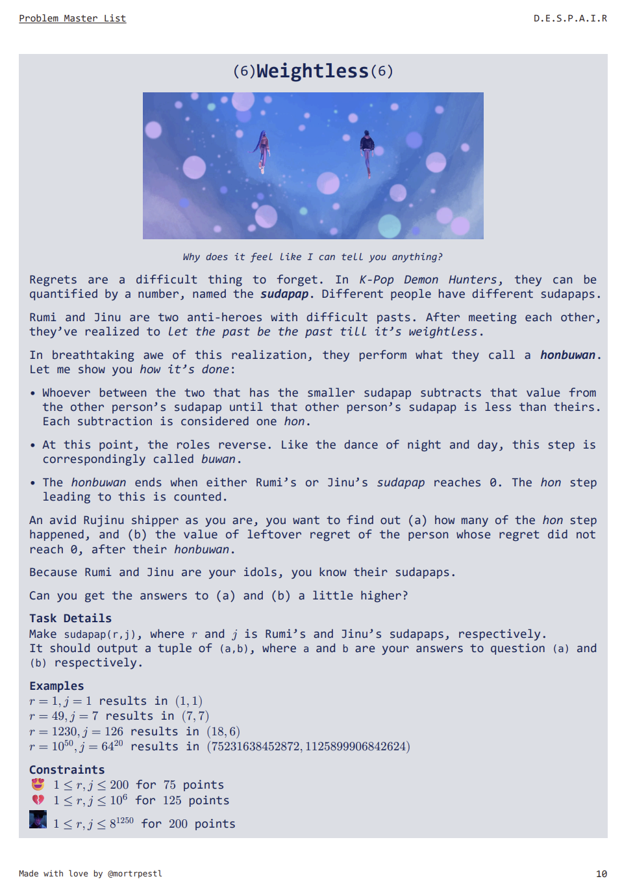
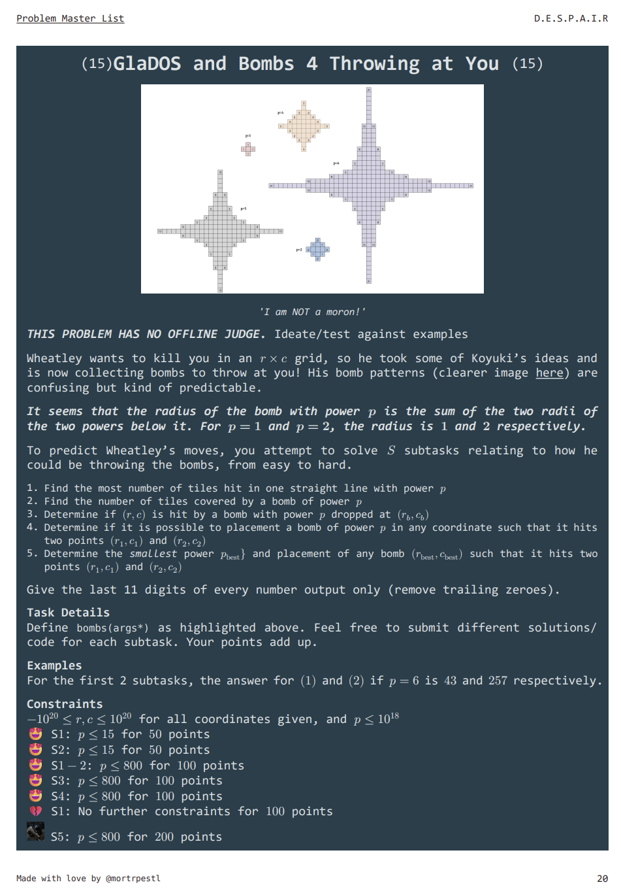

# Mortr's Code Pestle 🔨


If you are here, I will assume you are:

- trying to create a programming contest that does not require online hosting
- trying to run the Code Pestle in your home account;
- trying to learn for fun.

Enjoy!
## Introduction

__**Mortr's Code Pestle**__ is @mortrpestl (Diogn Mortera)'s solution to creating programming contests that run offline. 



The name of the project comes from the nature of the mortar and pestle, grinding material compounds until they're ground. In a way, this project is similar: a primitive (but accessible offline!) implementation of the Online Judges used in Codeforces and UPD's DMOJ fork.

It was made in order to allow my batchmates to simulate a hands-on programming exam experience with the problems I have made. You may see a list of these problems in the link.


# Creating a Programming Contest

This consists of two parts: (1) making problems and (2) adapting the judges for each problem.

## Making Problem Statements

<p float="center">
  
  
</p>

1. You may use the Typst template for the files, which can be found in `problem_template.typ`. This allows easy formatting of the problem specifications:

    -   modular creation of problems, makes them easy to reorder or assign new attributes by just changing one master problem template

    - support for math equations, code, and images

### Problem Module

```
#problem(
  title: "Empty Problem for Template",
  caption: "...",
  diff: ".",
  color: rgb("#7c245c"),
  invert: true,
  statement: [
     ],
  task: [
       ],
  examples: [
      ],
  constraints: [
     ]
)

```


- `title` - title of problem

- `img` - adds image below `title`. 

    - Put your image on the `assets` folder
    - Format with `#image(img:"assets/filename.ext", width: n%)`

- `caption` - adds caption below image

- `diff` - difficulty of problem, can be enabled by tweaking the `#problem` template

- `color` - background color of problem

- `invert` - option to invert color

- `statement` - the bulk of what the problem entails goes here

- `task` - the function definition and output formatting goes here

- `examples` - place sample input and output here

- `constraints` - place constraints here

## Creating Judges for the Problems

### The Paradigm
The checker checks like this:

- Take test cases from the `test_cases`
- Put those test cases through both `model_solution` and `student_solution`
- If the answers match, AC. Else, verdicts are given depending on the error/answer

Checkers come in the form of **tester packets**. For every problem, a tester packet is made. Therefore, edits in one tester packet, do not affect the other.


### Creating a Test Packet
After creating a problem, you may now start creating a **tester packet**:

1. Duplicate the `tester-packet` folder. You may choose to rename this folder however you wish (e.g. adding problem name/number)

2. The files important to you in `tester_packet` are as follows:

```
project-root/
├─ student_solution
├─ tester
└─ OJ/
   ├─ model_solution
   └─ test_cases
```

Note: Create a `tester_packet` for each problem, and it is recommended to rename each `tester_packet` to something that correlates to each problem to avoid being confused when modifying different packets.

### Parts of a Tester Packet

### `student_solution`

This is where the student will input their code. It contains the following code snippet:

```python
def solve(*T):
    ...

```

Students are to replace parameters inside the `solve(*T)` and write the code inside `solve(*T)`. They are allowed to create functions outside this function, as well as initiate global variables.

Students may be able to check their code by running it (through the standard `python3 student_solution` in the Terminal)

**NOTE:** solve() must have at least one paramter. On a related note, generator-based functions are still unsupported as of October 2025.

### `model_solution`

This is where the contest setter places their model solution. As mentioned, this will generate the (supposedly) correct answers to each test case, to be compared simultaneously to the answers from the `solve()` in `student_solution`

```python
def model():
    #solution to problem here
```
The contest setter has to be careful in placing the right parameters as stated in the problem statement. 


### `test_cases` 

Here lies the test cases to be fed to the `model_solution` and `student_solution` by the tester.

You are free to customize the subtask titles. 
- But to keep scalability, I do not recommend it

- You are also free to modify the points.

- Notice that there is no set limit on how many cases and subtasks there can be. You are free to add and remove subtasks and cases.
- **NOTE:** Wrap lone-element test cases with `[]`, because tester.py will attempt to splat it

```python
subtasks = {
    "Subtask 1": {
        "points": 200,
        "cases": [
            ("sample testcase",),
            ...
        ]
    },
    "Subtask 2": {
        "points": 169,
        "cases": [
            ("sample testcase",),
            ("sample test","cases",),
            (1,),
            (1,2,3,4,5,6,),
            ([1],[2],(5,6),(7),),
        ]
    }
}
```

### `tester`

This file serves as the bridge of the three files above:

- imports `solve()` and `model()` from `student_solution` and `model_solution` respectively
- imports test cases from `test_cases.py`
- compares answers of `solve()` and `model()`
- automatically returns raw and summarized information of verdicts (including errors such as TLE and MLE)


Do not attempt to touch the file if you're not sure what you're doing.

The rest of the files not in the folder tree above do not matter, but _please do not touch them_.

### Final Notes

Make sure the parameters of `model_solution` and `student_solution`, and the cases of `test_cases` match.

For example:

- for a problem with student function `solve(n, tup, word)`, model must also be `model(n,tup,L)`, and a properly formatted case would be `[1,(5,6,7),"hey"]`.
## Limitations/Improvements

- as of October 2025:
    - checking for generator-based and `print()`based problems is currently unsupported in `tester.py`. 
    - TLE detection is still done using `import multiprocessing`, which may be not available to all devices
- future plans
    - problem migration to a DMOJ fork
    - allow `print()` checking using `sys.readline()`

## Credits

- DCServer for introducing me to Typst
- UP DCS Batch 2025 for appreciating my efforts 💝

## License

MIT License

Copyright (c) 2025 [Diogn Mortera]

Permission is hereby granted, free of charge, to any person obtaining a copy
of this software and associated documentation files (the "Software"), to deal
in the Software without restriction, including without limitation the rights
to use, copy, modify, merge, publish, distribute, sublicense, and/or sell
copies of the Software, and to permit persons to whom the Software is
furnished to do so, subject to the following conditions:

The above copyright notice and this permission notice shall be included in
all copies or substantial portions of the Software.

THE SOFTWARE IS PROVIDED "AS IS", WITHOUT WARRANTY OF ANY KIND, EXPRESS OR
IMPLIED, INCLUDING BUT NOT LIMITED TO THE WARRANTIES OF MERCHANTABILITY,
FITNESS FOR A PARTICULAR PURPOSE AND NONINFRINGEMENT. IN NO EVENT SHALL THE
AUTHORS OR COPYRIGHT HOLDERS BE LIABLE FOR ANY CLAIM, DAMAGES OR OTHER
LIABILITY, WHETHER IN AN ACTION OF CONTRACT, TORT OR OTHERWISE, ARISING FROM,
OUT OF OR IN CONNECTION WITH THE SOFTWARE OR THE USE OR OTHER DEALINGS IN
THE SOFTWARE.
